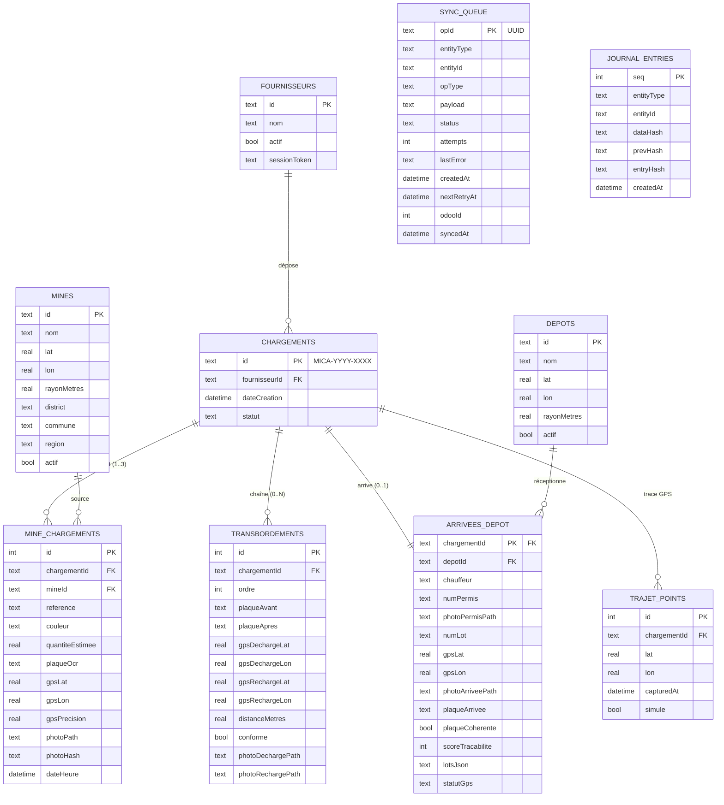

# Base de données — Mica Fleet

Base **SQLite locale** (chiffrée SQLCipher), gérée avec **Drift**. Schéma **version 7**.
Source de vérité de l'app (offline-first) ; les données remontent ensuite vers Odoo
via la file de synchronisation.

## Diagramme entité-relation

> `SYNC_QUEUE` et `JOURNAL_ENTRIES` sont transverses : ils référencent n'importe
> quelle entité par (`entityType`, `entityId`) — pas de clé étrangère physique.

## Tables

### Fournisseurs
Comptes des opérateurs de terrain. Utilisés pour l'authentification offline.

| Colonne | Type | Contrainte | Rôle |
|---|---|---|---|
| id | text | **PK** | Identifiant fournisseur |
| nom | text | non nul | Nom affiché |
| actif | bool | défaut true | Compte actif |
| sessionToken | text | nullable | Marque la session locale (login offline) |

### Mines
Référentiel des carrières (synchronisé depuis Odoo). Sert au contrôle GPS d'origine.

| Colonne | Type | Contrainte | Rôle |
|---|---|---|---|
| id | text | **PK** | Identifiant mine |
| nom | text | non nul | Nom carrière |
| lat, lon | real | non nul | Coordonnées officielles |
| rayonMetres | real | défaut 20 | Rayon autorisé autour du point |
| district, commune, region | text | nullable | Localisation administrative |
| actif | bool | défaut true | Mine autorisée/active |

### Depots
Référentiel des dépôts de destination. Sert au contrôle GPS d'arrivée.

| Colonne | Type | Contrainte | Rôle |
|---|---|---|---|
| id | text | **PK** | Identifiant dépôt |
| nom | text | non nul | Nom dépôt |
| lat, lon | real | non nul | Coordonnées |
| rayonMetres | real | défaut 20 | Rayon d'acceptation GPS |
| actif | bool | défaut true | Dépôt reconnu/actif |

### Chargements
Entité centrale. Un chargement = un transport mica de la mine au dépôt.
Identifiant unique `MICA-YYYY-XXXX`.

| Colonne | Type | Contrainte | Rôle |
|---|---|---|---|
| id | text | **PK** | `MICA-YYYY-XXXX` |
| fournisseurId | text | FK → Fournisseurs.id (logique) | Auteur |
| dateCreation | datetime | non nul | Départ (base des délais) |
| statut | text | défaut `brouillon` | `brouillon` / `valide` |

### MineChargements
Mines sources d'un chargement (**1 à 3**), avec photo, GPS, hash et données produit.

| Colonne | Type | Contrainte | Rôle |
|---|---|---|---|
| id | int | **PK** auto | — |
| chargementId | text | **FK** → Chargements.id | Rattachement |
| mineId | text | **FK** → Mines.id | Mine source |
| reference, couleur | text | nullable | Données produit |
| quantiteEstimee | real | nullable | Quantité (kg) |
| plaqueOcr | text | nullable | Plaque lue (OCR) |
| gpsLat, gpsLon, gpsPrecision | real | nullable | Position de capture |
| photoPath | text | nullable | Fichier photo |
| photoHash | text | nullable | SHA-256 (preuve infalsifiable) |
| dateHeure | datetime | nullable | Horodatage capture |

### Transbordements
Chaîne **dynamique 0..N** des changements de camion d'un chargement.
Ordonnée par `ordre` (1..N). Chaîne de plaques cohérente : `plaqueApres[i]` = `plaqueAvant[i+1]`.

| Colonne | Type | Contrainte | Rôle |
|---|---|---|---|
| id | int | **PK** auto | — |
| chargementId | text | **FK** → Chargements.id | Rattachement |
| ordre | int | non nul | Position dans la chaîne |
| plaqueAvant, plaqueApres | text | nullable | Camion sortant / entrant |
| gpsDechargeLat/Lon | real | nullable | Point de déchargement |
| gpsRechargeLat/Lon | real | nullable | Point de rechargement |
| distanceMetres | real | nullable | Écart décharge↔recharge |
| conforme | bool | défaut false | GPS dans le rayon |
| photoDechargePath, photoRechargePath | text | nullable | Preuves |

### ArriveesDepot
Réception au dépôt (**0..1** par chargement). Clé primaire = `chargementId`.

| Colonne | Type | Contrainte | Rôle |
|---|---|---|---|
| chargementId | text | **PK / FK** → Chargements.id | Un seul enregistrement |
| depotId | text | **FK** → Depots.id | Dépôt détecté |
| chauffeur | text | non nul | Nom chauffeur |
| numPermis | text | non nul | Permis |
| photoPermisPath | text | nullable | Photo permis (optionnel) |
| numLot | text | non nul | Lot (résumé) |
| lotsJson | text | nullable | `{couleur: n° lot}` (lots par couleur) |
| gpsLat, gpsLon | real | non nul | Position d'arrivée |
| photoArriveePath | text | nullable | Photo d'arrivée |
| plaqueArrivee | text | nullable | Plaque à l'arrivée |
| plaqueCoherente | bool | défaut true | Cohérence vs chaîne (anti-fraude) |
| scoreTracabilite | int | nullable | Score /100 calculé |
| statutGps | text | non nul | `valide` / `hors_zone` |

### TrajetPoints
Trace GPS du transport (points espacés de >20 m). `simule` distingue réel / simulation.

| Colonne | Type | Contrainte | Rôle |
|---|---|---|---|
| id | int | **PK** auto | — |
| chargementId | text | **FK** → Chargements.id | Rattachement |
| lat, lon | real | non nul | Point du parcours |
| capturedAt | datetime | non nul | Horodatage |
| simule | bool | défaut false | Réel (false) / simulé (true) |

### SyncQueue
File de synchronisation **op-based** vers Odoo. Une opération par mutation.

| Colonne | Type | Contrainte | Rôle |
|---|---|---|---|
| opId | text | **PK** (UUID) | Idempotence côté Odoo |
| entityType | text | non nul | `chargement` / `transbordement` / `arrivee_depot`… |
| entityId | text | non nul | Id de l'entité |
| opType | text | non nul | `create` / `update` / `delete` |
| payload | text | non nul | JSON de l'opération |
| status | text | défaut `pending` | `pending` / `syncing` / `synced` / `failed` |
| attempts | int | défaut 0 | Tentatives (max 5 → `failed`) |
| lastError | text | nullable | Dernière erreur |
| createdAt | datetime | non nul | Ordre FIFO |
| nextRetryAt | datetime | nullable | Backoff exponentiel |
| odooId | int | nullable | Id du record créé côté Odoo |
| syncedAt | datetime | nullable | Horodatage de succès |

### JournalEntries
Journal **immuable** append-only : chaque événement est haché et chaîné au précédent.
Toute altération casse la chaîne (`verifyChain`).

| Colonne | Type | Contrainte | Rôle |
|---|---|---|---|
| seq | int | **PK** | Séquence (ordre de chaînage) |
| entityType, entityId | text | non nul | Événement source |
| dataHash | text | non nul | SHA-256 du payload |
| prevHash | text | non nul | Hash du maillon précédent (`GENESIS` au début) |
| entryHash | text | non nul | SHA-256(seq \| prevHash \| dataHash) |
| createdAt | datetime | non nul | Horodatage |

## Relations (résumé)

- **Fournisseur** 1—N **Chargement** (logique, via `fournisseurId`)
- **Chargement** 1—N **MineChargement** (1 à 3) ; **MineChargement** N—1 **Mine**
- **Chargement** 1—N **Transbordement** (0 à N, chaîne ordonnée)
- **Chargement** 1—1 **ArriveeDepot** (0 ou 1) ; **ArriveeDepot** N—1 **Depot**
- **Chargement** 1—N **TrajetPoint** (trace GPS)
- **SyncQueue** et **JournalEntries** : liens logiques par (`entityType`, `entityId`)

## Notes

- **Migration** : actuellement destructive (`onUpgrade` recrée tout) — à remplacer
  par des migrations pas-à-pas avant la prod pour préserver les données.
- **Chiffrement** : base ouverte via SQLCipher au repos.
- **Photos** : stockées comme fichiers ; seul le chemin + le hash sont en base.
